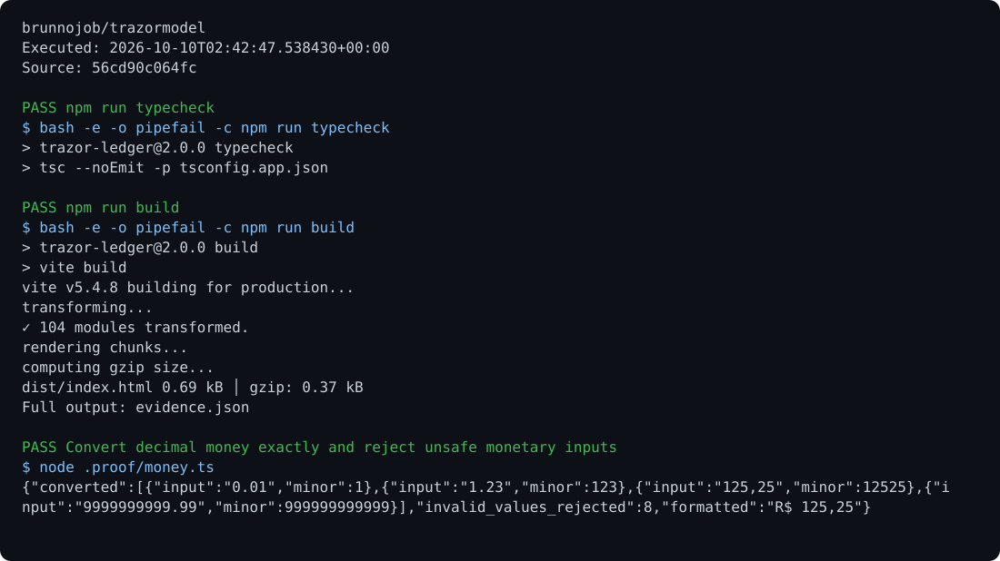

# Trazor Ledger

[View execution evidence](https://brunnojob.github.io/devstart-lab/proofs/trazormodel/)

Personal ledger accounts, income and expenses, persistent history, export, and transactional entries with expected revisions.

## Run

Requirements: React, TypeScript, and Supabase.

```sh
npm ci
npm run typecheck
npm run build
npm run dev
```

## Behavior

Set `VITE_SUPABASE_URL` and `VITE_SUPABASE_PUBLISHABLE_KEY`. Amounts are converted to cents before recording. `bd_book_entry` updates the balance and preserves history in the same transaction. This application records amounts supplied by the user; it does not hold or transfer cryptocurrency.

## Optional report archive

Use the [shared operations archive client](https://github.com/brunnojob/vercel-home-telemetry-api/tree/main/cloud) to queue `result.json` under project `trazorbypasssafe7`. The client uses `BRUNNODEV_ACCESS_TOKEN` and retains unacknowledged reports locally.

## License

Original source and documentation are MIT licensed; see [LICENSE](LICENSE). Third-party dependencies and media retain their respective terms. Maintained by [Brunno Dev](https://brunnodev.store).

## Implementation update

Authentication changes invalidate pending writes and account refreshes. Responses started under an earlier session cannot repopulate account state after a user change or sign-out.

Contribution trailer: `Co-authored-by: nyctophile <33561761+ineedfoundmyway@users.noreply.github.com>`.

## Execution proof

[](https://github.com/brunnojob/trazormodel/actions/workflows/proof.yml)



[Verified run](https://github.com/brunnojob/trazormodel/actions/runs/38017953441) · [Execution report](docs/proof/evidence.json)

Run `python .proof/record.py` after installing the prerequisites above. The scenarios execute repository code and verify exit codes and expected output. CI publishes `execution-proof` with the transcript, input fingerprints and source commit. The downloadable report identifies the exact tested version; the workflow badge tracks the latest run.
